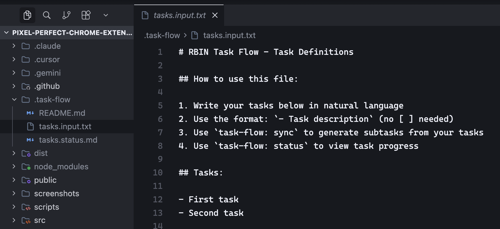
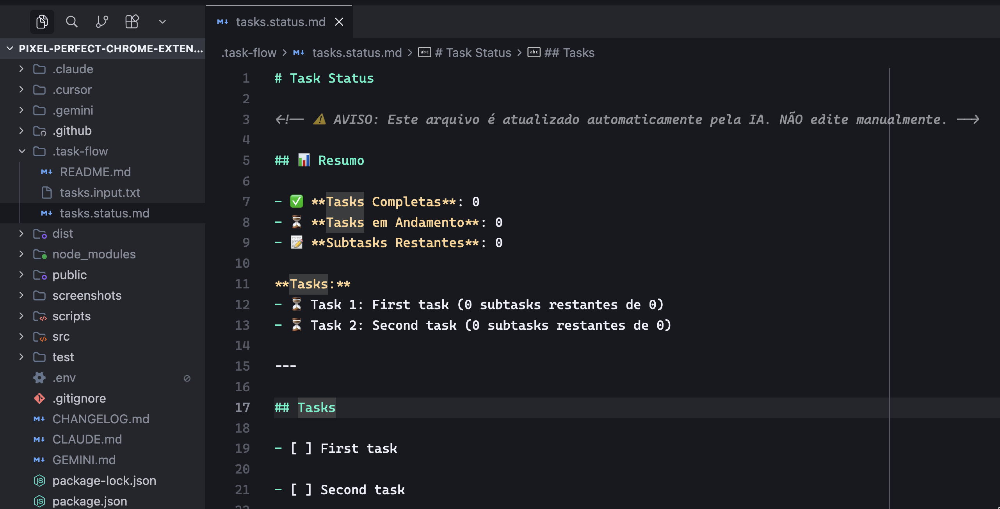
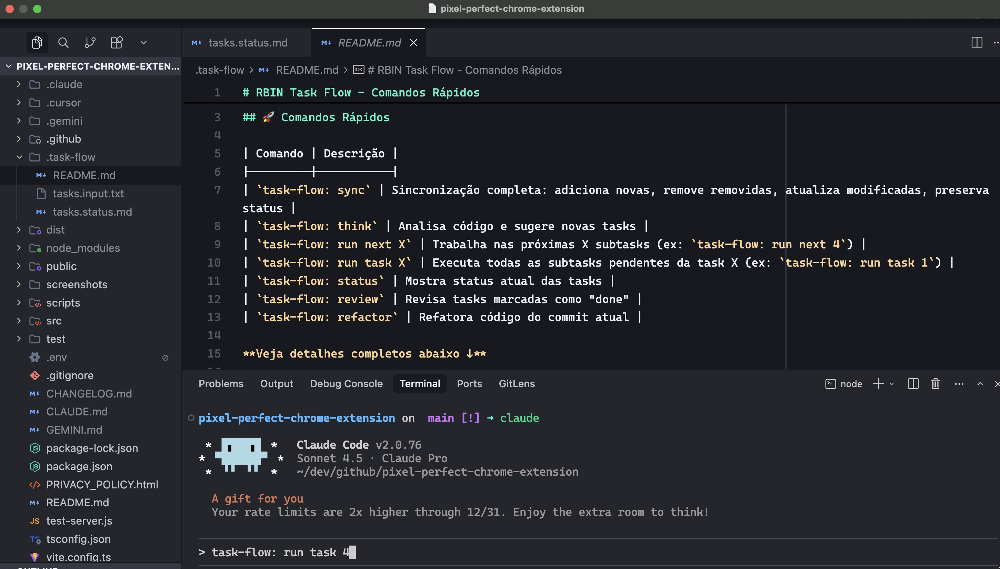

# RBIN Task Flow

<div align="center">


**Configuração com um comando para Claude Code, Gemini, Cursor e RBIN Task Flow em qualquer projeto**

<div style="margin-top: 20px; margin-bottom: 20px;">
  <a href="#português">🇧🇷 Português</a> | <a href="#english">🇬🇧 English</a>
</div>

</div>

---

<div align="center">

### Screenshots





</div>

---

<a id="português"></a>
# 🇧🇷 Português

## O Que É Este Projeto?

RBIN Task Flow é um sistema de gerenciamento de tarefas alimentado por IA que configura automaticamente Claude Code, Gemini e Cursor IDE em qualquer projeto. Você define tarefas em texto simples e a IA gera subtarefas detalhadas e acionáveis automaticamente.

**Principais benefícios:**
- ✅ Instalação global NPM - instale uma vez, use em qualquer projeto
- ✅ Zero configuração - pronto para usar imediatamente
- ✅ Gerenciamento simples - escreva tarefas em texto, a IA faz o resto
- ✅ Múltiplos modelos de IA - Claude, Gemini e Cursor configurados

## Instalação

### Início Rápido (NPM Global)

```bash
# 1. Instalar globalmente via npm (apenas uma vez)
npm install -g rbin-task-flow

# 2. Ir para qualquer projeto e inicializar
cd /caminho/para/seu/projeto
rbin-task-flow init

# 3. Usar comandos da IA
# Edite .task-flow/tasks.input.txt e use:
# - task-flow: sync
# - task-flow: run next X
# - task-flow: run task X
```

**Pronto!** RBIN Task Flow agora está disponível globalmente no seu sistema.

## Comandos

### Comandos CLI

```bash
rbin-task-flow init          # Inicializa no projeto atual
rbin-task-flow update        # Atualiza configurações
rbin-task-flow version-check # Verifica atualizações de modelos
rbin-task-flow info          # Mostra informações
```

### Comandos da IA - Por Que Usar?

Após inicializar, use estes comandos na IA (Cursor/Claude/Gemini) para gerenciar tarefas automaticamente:

| Comando | Por Que Usar | Feature Principal |
|---------|--------------|-------------------|
| `task-flow: sync` | **Sincroniza** tarefas do arquivo texto com o sistema | Mantém tudo sincronizado automaticamente - adiciona novas, remove deletadas, preserva seu progresso |
| `task-flow: think` | **Descobre** tarefas que você esqueceu | Analisa código e sugere tarefas que faltam (testes, refatoração, documentação) |
| `task-flow: run next X` | **Automatiza** o trabalho nas próximas subtarefas | A IA trabalha nas próximas X subtarefas sequencialmente, você só acompanha |
| `task-flow: run task X` | **Completa** uma tarefa inteira de uma vez | Executa todas as subtarefas de uma tarefa específica (permite trabalho paralelo) |
| `task-flow: status` | **Visualiza** o progresso rapidamente | Vê resumo com tasks completas, em andamento e quantas subtarefas faltam |
| `task-flow: review` | **Garante** qualidade do trabalho | Verifica se tarefas marcadas como "done" estão realmente concluídas |
| `task-flow: refactor` | **Melhora** código sem quebrar | Refatora código do commit atual removendo comentários e melhorando qualidade |

**Fluxo típico:**

```bash
# 1. Instalar e inicializar
npm install -g rbin-task-flow
cd meu-projeto && rbin-task-flow init

# 2. Editar tarefas em texto simples
# Edite .task-flow/tasks.input.txt:
# - Criar sistema de autenticação
# - Adicionar testes

# 3. Usar comandos da IA:
# "task-flow: sync" → Gera subtarefas detalhadas automaticamente
# "task-flow: run next 3" → IA trabalha nas próximas 3 subtarefas
# "task-flow: status" → Vê progresso visual
```

## Visão Geral

Repositório centralizado de configurações e regras de desenvolvimento que podem ser instaladas instantaneamente em qualquer projeto. Fornece configuração completa para Claude Code, Gemini, Cursor IDE e RBIN Task Flow - um sistema simples de gerenciamento de tarefas alimentado por IA.

### Principais Recursos

- **Instalação Global NPM** - Instale uma vez, use em qualquer lugar com `npm install -g rbin-task-flow`
- **Gerenciamento Simples de Tarefas** - Defina tarefas em texto simples, a IA gera subtarefas detalhadas
- **Múltiplos Modelos de IA** - Claude Code Sonnet e Gemini 3 Flash configurados e prontos para uso
- **.gitignore Discreto** - Configurações de IA ocultas com comentários genéricos
- **Zero Configuração** - Pronto para usar imediatamente
- **RBIN Task Flow** - Gerenciamento de tarefas alimentado por IA com interface de texto simples

## Requisitos do Sistema

- **Sistema Operacional:** macOS, Linux ou Windows (WSL)
- **Ferramentas:** Git, Bash, Node.js
- **Necessário:** Claude Code CLI, acesso à API Gemini ou Cursor IDE (com assinatura Pro)

### Alternativa: Instalação Legacy (Sem NPM)

Se você preferir o método antigo sem npm:

```bash
# 1. Clonar este repositório
git clone https://github.com/rbinoliveira/rbin-task-flow.git ~/.rbin-task-flow

# 2. Instalar no seu projeto
~/.rbin-task-flow/install.sh
# Digite o caminho do projeto quando solicitado
```

### O Que É Instalado

O script cria e configura:

```
seu-projeto/
├── .cursor/
│   ├── rules/                    # Todas as regras de desenvolvimento
│   │   ├── cursor_rules.mdc
│   │   ├── self_improve.mdc
│   │   ├── code_comments.mdc
│   │   ├── commit_practices.mdc
│   │   ├── git_control.mdc
│   │   └── task_execution.mdc
│   └── settings.json             # Configurações do modelo Cursor
│
├── .claude/
│   └── settings.json             # Configurações do Claude Code
│
├── .gemini/
│   └── settings.json             # Configurações do Gemini
│
├── .task-flow/                   # RBIN Task Flow
│   ├── tasks.input.txt           # Definições de tarefas em texto simples (edite isso!)
│   ├── tasks.status.md           # ⚠️ Status das tarefas (atualizado automaticamente, NÃO EDITE)
│   └── .internal/                # ⚠️ Arquivos internos do sistema (ignore - gerados automaticamente)
│       ├── tasks.json            # Definições de tarefas (auto)
│       └── status.json           # Rastreamento de status das tarefas (auto)
│
└── .gitignore                    # Atualizado com entradas discretas
```

## Configuração

Nenhuma configuração adicional necessária! Apenas certifique-se de ter:
- Claude Code CLI instalado, OU
- Acesso à API Gemini configurado, OU
- Cursor IDE com assinatura Pro ativa

**Você está pronto!**

### Integração com Cursor

O Cursor vem pré-configurado com:
- Claude Sonnet 4.5 Pro como modelo padrão
- Configurações personalizadas
- Integração com RBIN Task Flow
- Melhores práticas de desenvolvimento

Todas as regras são automaticamente ativas no Cursor. O IDE irá:
- Seguir padrões de codificação de `.cursor/rules/`
- Integrar com fluxos de trabalho do RBIN Task Flow
- Seguir práticas de commit e git

### Integração com Claude Code

O Claude Code vem pré-configurado com:
- Configurações personalizadas
- Integração com RBIN Task Flow
- Melhores práticas de desenvolvimento

### Integração com Gemini

O Gemini vem pré-configurado com:
- Configurações personalizadas
- Integração com RBIN Task Flow
- Melhores práticas de desenvolvimento

## O Que Está Configurado

### Regras de Desenvolvimento

Regras incluídas para:
- Formatação de regras do Cursor
- Processos de auto-melhoria
- Padrões de comentários de código
- Práticas de commit
- Controle de comandos git
- Gerenciamento de execução de tarefas

### RBIN Task Flow

Gerenciamento de tarefas simples e poderoso:
- **Entrada de Texto Simples**: Escreva tarefas em `.task-flow/tasks.input.txt` usando formato simples
- **Geração Alimentada por IA**: Transforma tarefas simples em subtarefas detalhadas e acionáveis
- **Instruções Inteligentes**: Cada subtarefa inclui contexto, objetivos, etapas de implementação e validação
- **Rastreamento Simples**: Gerenciamento de status baseado em JSON com comandos CLI fáceis
- **Monitoramento de Progresso**: Feedback visual claro sobre a conclusão das tarefas

## .gitignore Discreto

O instalador adiciona estas entradas ao `.gitignore`:

```gitignore
.claude/
.gemini/
.cursor/
.task-flow/
CLAUDE.md
GEMINI.md
```

**Por que discreto?**
- Sem comentários explicando o que são
- Sem menção a "IA", "Claude" ou "Anthropic"
- Tudo relacionado ao RBIN Task Flow permanece local
- Histórico git limpo sem arquivos de ferramentas de IA

## Atualizando Projetos

Para atualizar configurações em um projeto existente:

```bash
# Usando NPM (recomendado)
cd /caminho/para/seu/projeto
rbin-task-flow update

# Ou usando método legacy
~/.rbin-task-flow/install.sh
# Digite o caminho do projeto
```

O instalador irá:
- ✅ Copiar novas regras (sempre sobrescreve)
- ✅ **Sobrescrever arquivos de configuração** (settings.json) com as versões mais recentes
- ✅ Atualizar .gitignore se necessário
- ✅ Atualizar scripts do Task Flow (sempre sobrescreve)
- ✅ **Preservar seus dados**: `.internal/tasks.json` e `.internal/status.json` **NÃO são sobrescritos** (suas tarefas permanecem seguras)

**Nota**: O instalador adiciona automaticamente `.task-flow/` ao `.gitignore`, mantendo seu progresso de tarefas privado e fora do controle de versão.

## Estrutura do Projeto

Este repositório contém:

```
rbin-task-flow/
├── .cursor/
│   ├── settings.json             # Configurações do modelo Cursor
│   └── rules/                   # Todas as regras de desenvolvimento
│
├── .claude/
│   └── settings.json             # Configurações do Claude Code
│
├── .gemini/
│   └── settings.json             # Configurações do Gemini
│
├── .task-flow/
│   ├── README.md                 # Referência rápida de comandos
│   ├── tasks.input.txt           # Template de definições de tarefas
│   ├── tasks.status.md           # ⚠️ Template de status de tarefas (NÃO EDITE manualmente)
│   └── .internal/                # ⚠️ Arquivos internos do sistema (ignore - gerados automaticamente)
│       ├── tasks.json            # Definições de tarefas (auto)
│       └── status.json           # Rastreamento de status de tarefas (auto)
│
├── .gitignore                    # Template gitignore
├── .model-versions.json          # Referência de versão do modelo (atualize quando novos modelos forem lançados)
├── CLAUDE.md                     # Instruções principais do Claude
├── GEMINI.md                     # Instruções principais do Gemini
├── install.sh                    # Script de instalação
└── README.md                     # Este arquivo
```

## Notas Importantes

- ⚠️ Este é um **repositório template** - não use RBIN Task Flow aqui
- ✅ Use RBIN Task Flow em **projetos que recebem** as configurações via instalação
- 🔄 O instalador **sempre sobrescreve** configurações existentes
- 🤫 As entradas do .gitignore são **discretas** (sem menções a IA)
- 🎯 Funciona com **Claude Code CLI**, **API Gemini** ou **Cursor Pro**
- 📦 O diretório Task Flow (`.task-flow/`) é **automaticamente gitignored**
- 📝 Defina tarefas em `.task-flow/tasks.input.txt` usando formato simples: `- Descrição da tarefa`
- 🚀 **Instalação Global NPM**: `npm install -g rbin-task-flow`, depois use `rbin-task-flow init` em qualquer projeto
- 🔒 **Chaves de API podem ser necessárias** - depende do seu provedor de IA (Claude Code, API Gemini ou Cursor Pro)
- 🔔 **Verificação de versão do modelo** - Use `rbin-task-flow version-check` para verificar versões mais recentes dos modelos (verificação rápida e local)

## Atualizando Versões dos Modelos

Quando novas versões de modelos forem lançadas, atualize `.model-versions.json` neste repositório:

```json
{
  "claude": {
    "current": "claude-sonnet-4-5-20250929",
    "latest": "NOVA_VERSÃO_AQUI",
    "checkUrl": "https://docs.anthropic.com/claude/docs/models-overview"
  },
  "cursor": {
    "current": "claude-sonnet-4-5-20250929",
    "latest": "NOVA_VERSÃO_AQUI",
    "checkUrl": "https://docs.cursor.com/models"
  },
  "gemini": {
    "current": "gemini-3-flash",
    "latest": "NOVA_VERSÃO_AQUI",
    "checkUrl": "https://ai.google.dev/models/gemini"
  }
}
```

O instalador verificará automaticamente versões mais recentes dos modelos e **perguntará individualmente** se você deseja atualizar cada um (Claude, Cursor, Gemini). Esta verificação é **rápida e local** - sem chamadas de API, sem solicitações de rede, apenas uma simples comparação de strings.

**Atualizações Interativas:** Quando uma versão mais recente estiver disponível, o instalador irá:
- Mostrar versões atuais e mais recentes
- Perguntar: "Atualizar [Modelo] para a versão mais recente? [y/N]"
- Atualizar apenas se você confirmar com `y`
- Pular se você pressionar Enter ou digitar `n`

**Importante:** As atualizações de versão do modelo funcionam de forma diferente:

- **Ao instalar em um projeto de destino** (passando um caminho):
  - O instalador **copia/substitui** arquivos do template do repositório para o projeto de destino
  - **SEM prompts de atualização de modelo** - apenas copia o que está no template
  - O projeto de destino recebe as versões atuais do template

- **Ao executar o instalador no próprio repositório** (rbin-task-flow):
  - Se novas versões de modelos forem detectadas, você pode escolher atualizá-las
  - As atualizações são aplicadas **apenas aos arquivos do template do repositório**
  - Após atualizar o template, execute o instalador nos projetos para aplicar as novas versões

**Fluxo de Trabalho:**
1. Execute o instalador em um projeto → copia arquivos do template atual para o projeto (sem prompts de atualização)
2. Para atualizar o template do repositório → execute o instalador no próprio repositório, escolha atualizar
3. Execute o instalador novamente nos projetos → copia arquivos do template atualizados para os projetos

Você tem controle total - as atualizações de modelo acontecem apenas no template do repositório, não nos projetos de destino.

## Contribuindo

Contribuições são bem-vindas! Para adicionar novas regras ou melhorar templates:

1. Faça um fork deste repositório
2. Crie um branch de feature
3. Adicione suas regras/templates seguindo os formatos existentes
4. Teste em um projeto real
5. Envie um Pull Request

## Licença

Licença MIT - Veja o arquivo LICENSE para detalhes

## Suporte

Para problemas ou perguntas:
- Abra uma issue no GitHub
- Verifique issues existentes para soluções
- Consulte CHANGELOG.md para atualizações recentes

---

<a id="english"></a>
# 🇬🇧 English

## What Is This Project?

RBIN Task Flow is an AI-powered task management system that automatically configures Claude Code, Gemini, and Cursor IDE in any project. You define tasks in plain text and the AI automatically generates detailed, actionable subtasks.

**Key benefits:**
- ✅ Global NPM installation - install once, use in any project
- ✅ Zero configuration - ready to use immediately
- ✅ Simple management - write tasks in text, AI does the rest
- ✅ Multiple AI models - Claude, Gemini, and Cursor configured

## Installation

### Quick Start (NPM Global)

```bash
# 1. Install globally via npm (one time only)
npm install -g rbin-task-flow

# 2. Go to any project and initialize
cd /path/to/your/project
rbin-task-flow init

# 3. Use AI commands
# Edit .task-flow/tasks.input.txt and use:
# - task-flow: sync
# - task-flow: run next X
# - task-flow: run task X
```

**That's it!** RBIN Task Flow is now available globally on your system.

## Commands

### CLI Commands

```bash
rbin-task-flow init          # Initialize in current project
rbin-task-flow update        # Update configurations
rbin-task-flow version-check # Check for model updates
rbin-task-flow info          # Show information
```

### AI Commands - Why Use Them?

After initializing, use these commands in your AI (Cursor/Claude/Gemini) to automatically manage tasks:

| Command | Why Use It | Key Feature |
|---------|------------|-------------|
| `task-flow: sync` | **Sync** tasks from text file with system | Keeps everything synchronized automatically - adds new, removes deleted, preserves your progress |
| `task-flow: think` | **Discover** tasks you forgot | Analyzes code and suggests missing tasks (tests, refactoring, documentation) |
| `task-flow: run next X` | **Automate** work on next subtasks | AI works on next X subtasks sequentially, you just follow along |
| `task-flow: run task X` | **Complete** an entire task at once | Executes all subtasks of a specific task (allows parallel work) |
| `task-flow: status` | **Visualize** progress quickly | See summary with completed tasks, in progress, and remaining subtasks |
| `task-flow: review` | **Ensure** work quality | Verifies that tasks marked as "done" are actually completed |
| `task-flow: refactor` | **Improve** code without breaking | Refactors code from current commit removing comments and improving quality |

**Typical workflow:**

```bash
# 1. Install and initialize
npm install -g rbin-task-flow
cd my-project && rbin-task-flow init

# 2. Edit tasks in plain text
# Edit .task-flow/tasks.input.txt:
# - Create authentication system
# - Add tests

# 3. Use AI commands:
# "task-flow: sync" → Automatically generates detailed subtasks
# "task-flow: run next 3" → AI works on next 3 subtasks
# "task-flow: status" → View visual progress
```

## Overview

A centralized repository of development configurations and rules that can be instantly installed in any project. Provides complete setup for Claude Code, Gemini, Cursor IDE, and RBIN Task Flow - a simple AI-powered task management system.

### Key Features

- **NPM Global Installation** - Install once, use everywhere with `npm install -g rbin-task-flow`
- **Simple Task Management** - Define tasks in plain text, AI generates detailed subtasks
- **Multiple AI Models** - Claude Code Sonnet and Gemini 3 Flash configured and ready to use
- **Discrete .gitignore** - AI configs hidden with generic comments
- **Zero Configuration** - Ready to use immediately
- **RBIN Task Flow** - AI-powered task management with simple text interface

## System Requirements

- **Operating System:** macOS, Linux, or Windows (WSL)
- **Tools:** Git, Bash, Node.js
- **Required:** Claude Code CLI, Gemini API access, or Cursor IDE (with Pro subscription)

### Alternative: Legacy Installation (Without NPM)

If you prefer the old method without npm:

```bash
# 1. Clone this repository
git clone https://github.com/rbinoliveira/rbin-task-flow.git ~/.rbin-task-flow

# 2. Install in your project
~/.rbin-task-flow/install.sh
# Enter your project path when prompted
```

### What Gets Installed

The script creates and configures:

```
your-project/
├── .cursor/
│   ├── rules/                    # All development rules
│   │   ├── cursor_rules.mdc
│   │   ├── self_improve.mdc
│   │   ├── code_comments.mdc
│   │   ├── commit_practices.mdc
│   │   ├── git_control.mdc
│   │   └── task_execution.mdc
│   └── settings.json             # Cursor model settings
│
├── .claude/
│   └── settings.json             # Claude Code settings
│
├── .gemini/
│   └── settings.json             # Gemini settings
│
├── .task-flow/                   # RBIN Task Flow
│   ├── tasks.input.txt           # Plain text task definitions (edit this!)
│   ├── tasks.status.md           # ⚠️ Task status (auto-updated, DO NOT EDIT)
│   └── .internal/                # ⚠️ Internal system files (ignore - auto-generated)
│       ├── tasks.json            # Task definitions (auto)
│       └── status.json           # Task status tracking (auto)
│
└── .gitignore                    # Updated with discrete entries
```

## Configuration

No additional configuration required! Just make sure you have:
- Claude Code CLI installed, OR
- Gemini API access configured, OR
- Cursor IDE with an active Pro subscription

**You're ready!**

### Cursor Integration

Cursor is pre-configured with:
- Claude Sonnet 4.5 Pro as default model
- Custom settings
- RBIN Task Flow integration
- Development best practices

All rules are automatically active in Cursor. The IDE will:
- Follow coding standards from `.cursor/rules/`
- Integrate with RBIN Task Flow workflows
- Follow commit and git practices

### Claude Code Integration

Claude Code is pre-configured with:
- Custom settings
- RBIN Task Flow integration
- Development best practices

### Gemini Integration

Gemini is pre-configured with:
- Custom settings
- RBIN Task Flow integration
- Development best practices

## What's Configured

### Development Rules

Included rules for:
- Cursor rule formatting
- Self-improvement processes
- Code commenting standards
- Commit practices
- Git command control
- Task execution management

### RBIN Task Flow

Simple yet powerful task management:
- **Plain Text Input**: Write tasks in `.task-flow/tasks.input.txt` using simple format
- **AI-Powered Generation**: Transforms simple tasks into detailed, actionable subtasks
- **Smart Instructions**: Each subtask includes context, objectives, implementation steps, and validation
- **Simple Tracking**: JSON-based status management with easy CLI commands
- **Progress Monitoring**: Clear visual feedback on task completion

## Discrete .gitignore

The installer adds these entries to `.gitignore`:

```gitignore
.claude/
.gemini/
.cursor/
.task-flow/
CLAUDE.md
GEMINI.md
```

**Why discrete?**
- No comments explaining what they are
- No mention of "AI", "Claude", or "Anthropic"
- Everything related to RBIN Task Flow stays local
- Clean git history without AI tooling files

## Updating Projects

To update configs in an existing project:

```bash
# Using NPM (recommended)
cd /path/to/your/project
rbin-task-flow update

# Or using legacy method
~/.rbin-task-flow/install.sh
# Enter the project path
```

The installer will:
- ✅ Copy new rules (always overwrites)
- ✅ **Overwrite config files** (settings.json) with latest versions
- ✅ Update .gitignore if needed
- ✅ Update Task Flow scripts (always overwrites)
- ✅ **Preserve your data**: `.internal/tasks.json` and `.internal/status.json` are **NOT overwritten** (your tasks stay safe)

**Note**: The installer automatically adds `.task-flow/` to `.gitignore`, keeping your task progress private and out of version control.

## Project Structure

This repository contains:

```
rbin-task-flow/
├── .cursor/
│   ├── settings.json             # Cursor model settings
│   └── rules/                    # All development rules
│
├── .claude/
│   └── settings.json             # Claude Code settings
│
├── .gemini/
│   └── settings.json             # Gemini settings
│
├── .task-flow/
│   ├── README.md                 # Quick commands reference
│   ├── tasks.input.txt           # Task definitions template
│   ├── tasks.status.md           # ⚠️ Task status template (DO NOT EDIT manually)
│   └── .internal/                # ⚠️ Internal system files (ignore - auto-generated)
│       ├── tasks.json            # Task definitions (auto)
│       └── status.json           # Task status tracking (auto)
│
├── .gitignore                    # Template gitignore
├── .model-versions.json          # Model version reference (update when new models are released)
├── CLAUDE.md                     # Main Claude instructions
├── GEMINI.md                     # Main Gemini instructions
├── install.sh                    # Installation script
└── README.md                     # This file
```

## Important Notes

- ⚠️ This is a **template repository** - don't use RBIN Task Flow here
- ✅ Use RBIN Task Flow in **projects that receive** the configs via installation
- 🔄 Installer **always overwrites** existing configs
- 🤫 .gitignore entries are **discrete** (no AI mentions)
- 🎯 Works with **Claude Code CLI**, **Gemini API**, or **Cursor Pro**
- 📦 Task Flow directory (`.task-flow/`) is **automatically gitignored**
- 📝 Define tasks in `.task-flow/tasks.input.txt` using simple format: `- Task description`
- 🚀 **NPM Global Install**: `npm install -g rbin-task-flow`, then use `rbin-task-flow init` in any project
- 🔒 **API keys may be required** - depends on your AI provider (Claude Code, Gemini API, or Cursor Pro)
- 🔔 **Model version checking** - Use `rbin-task-flow version-check` to check for newer model versions (fast, local check)

## Updating Model Versions

When new model versions are released, update `.model-versions.json` in this repository:

```json
{
  "claude": {
    "current": "claude-sonnet-4-5-20250929",
    "latest": "NEW_VERSION_HERE",
    "checkUrl": "https://docs.anthropic.com/claude/docs/models-overview"
  },
  "cursor": {
    "current": "claude-sonnet-4-5-20250929",
    "latest": "NEW_VERSION_HERE",
    "checkUrl": "https://docs.cursor.com/models"
  },
  "gemini": {
    "current": "gemini-3-flash",
    "latest": "NEW_VERSION_HERE",
    "checkUrl": "https://ai.google.dev/models/gemini"
  }
}
```

The installer will automatically check for newer model versions and **ask you individually** if you want to update each one (Claude, Cursor, Gemini). This check is **fast and local** - no API calls, no network requests, just a simple string comparison.

**Interactive Updates:** When a newer version is available, the installer will:
- Show current and latest versions
- Ask: "Update [Model] to latest version? [y/N]"
- Update only if you confirm with `y`
- Skip if you press Enter or type `n`

**Important:** Model version updates work differently:

- **When installing in a target project** (passing a path):
  - The installer **copies/replaces** files from the repository template to the target project
  - **NO model update prompts** - just copies what's in the template
  - Target project receives the current template versions

- **When running installer in the repository itself** (rbin-task-flow):
  - If new model versions are detected, you can choose to update them
  - Updates are applied **only to the repository template** files
  - After updating the template, run installer on projects to apply the new versions

**Workflow:**
1. Run installer on a project → copies current template files to project (no update prompts)
2. To update repository template → run installer in the repository itself, choose to update
3. Run installer again on projects → copies updated template files to projects

You have full control - model updates only happen in the repository template, not in target projects.

## Contributing

Contributions welcome! To add new rules or improve templates:

1. Fork this repository
2. Create a feature branch
3. Add your rules/templates following existing formats
4. Test in a real project
5. Submit a Pull Request

## License

MIT License - See LICENSE file for details

## Support

For issues or questions:
- Open an issue on GitHub
- Check existing issues for solutions
- Refer to CHANGELOG.md for recent updates

---

<div align="center">

**Made with ❤️ for developers who love simple, AI-powered workflows**

<a href="#português">🇧🇷 Português</a> | <a href="#english">🇬🇧 English</a> | <a href="#rbin-task-flow">⬆ Back to top</a>

</div>
